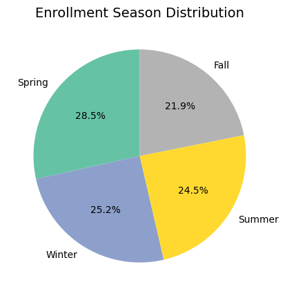

# CMI-PIU - Team 14 - 2425I INT3405E 56

## Introduction

In today’s digital age, problematic internet use among children and adolescents is a growing concern. Better understanding of this issue is crucial for addressing mental health problems such as depression and anxiety. Problematic Internet Use is a competition on online platform Kaggle, hosted by Child Mind Institute. The main aim of the competition is to use the training data provided to predict sii or Severity Impairment Index, which is a standard measure of Problematic Internet Use (PIU). The higher the sii (and in effect the PIU), the greater the degree of unhealthy internet usage in young people.

This repository contains our final submission for the Kaggle competition, saved to the `CMI_final.ipynb`. Note that this file is a copy of the notebook used for the submission on Kaggle, that explains why some of the data paths are unusual.

## Evaluation Metrics

Submissions will be evaluated using the quadratic weighted kappa (QWK) score, a metric that quantifies the agreement between the predicted SII values and the actual (ground truth) SII values. This scoring method is especially suitable because the problem is actually a Categorization problem, where the categories are ordinal, meaning they have a natural order.

The quadratic weighted Kappa is calculated as:

$$\kappa_w = 1 - \frac{\sum_{i,j} W_{i,j} O_{i,j}}{\sum_{i,j} W_{i,j} E_{i,j}}$$

Information on this formula is described in the [competition's Evaluation section](www.kaggle.com/competitions/child-mind-institute-problematic-internet-use/overview/evaluation)

Unlike simpler agreement measures, for example, Cohen's Kappa or Percent Agreement, which treats all disagreements equally, quadratic weighting penalizes disagreements based on the squared difference in category scores, giving more weight to larger disagreements.

The interpretation of $\kappa_w$ is similar to Cohen's Kappa:

- Values close to 1 indicate almost perfect agreement.
- Values around 0 indicate agreement no better than chance.
- Negative values indicate agreement worse than chance.

## Data Workflow

### Dataset

The tabular training dataset contains information on 3960 children and adolescents, with each record having 81 features (not counting unique ID). The target variable, `sii` (Severity Impairment Index), is derived from the `PCIAT-PCIAT_Total` field (PCIAT is short for Parent-Child Internet Addiction Test). The test dataset, however, is structured differently. It lacks the PCIAT fields, resulting in only 58 features compared to the 81 features in the training data.

The dataset's 81 features are categorized into 11 groups, the groups include:

- Demographics - Information about age and sex of participants.
- Internet Use - Number of hours of using computer/internet per day.
- Children's Global Assessment Scale - Numeric scale used by mental health clinicians to rate the general functioning of youths under the age of 18.
- Physical Measures - Collection of blood pressure, heart rate, height, weight and waist, and hip measurements.

...and more. Information about the features can be found in the [Kaggle competition page about the dataset](https://www.kaggle.com/competitions/child-mind-institute-problematic-internet-use/data).

Some distribution of features:




The accelerometer (actigraphy) data is stored in Apache Parquet files, organized by participant ID within separate directories for training and testing data (specifically, series\_{train|test}.parquet/id={id}). Each participant's data forms a continuous time series of accelerometer readings collected over several days.

### Data Analysis

#### Target Variable `sii`

The target variable `sii` is derived from the `PCIAT-PCIAT_Total` score, and from our analysis, the mapping is roughly as follows:

If PCIAT_Total scores from:

- $[0, 30] \mapsto 0$ (**None** category)
- $[31, 49] \mapsto 1$ (**Mild** category)
- $[50, 79] \mapsto 2$ (**Moderate** category)
- $\gt 80 \mapsto 3$ (**Severe** category)


This makes sii instead of the `float64` type as identified by pandas, it is instead an **ordinal categorical variable** with four ordered levels, meaning the order of the categories (None, Mild, Moderate, Severe) has a specific meaning and reflects increasing severity.

A problem we identified early on was that there is a large number of records where `sii` is missing ($31\%$ of the 3960 records). This will get expanded to other features below.

Label $0$ is much more frequent than labels $1$, $2$, and $3$. Label $3$, in particular, is exceedingly rare, making up only $0.012\%$ of the total labels (not counting any missing values), which indicates a class imbalance problem.


### Features

The missing values problem not only applies `sii`, this is also a problem we have to overcome when processing other fields. For the other fields, a substantial portion of the data is missing. Specifically, 77 out of the 81 columns have some missing values, and in 13 of those columns, more than $50\%$ of the data is missing.


We [mentioned](#target-variable-sii) that there is a certain mapping between `sii` - our target variable - and `PCIAT-PCIAT_Total` field. We used this to our advantage by assuming that `PCIAT-PCIAT_Total` can somewhat **substitute** `sii`, meaning that instead of predicting `sii`, we predict `PCIAT-PCIAT_Total`. This is what we do in our [Gradient Boosting Regression model](#regression-with-gradient-boosting).

Here's a partial correlation heatmap between `PCIAT-PCIAT_Total` and the rest of the features, the full heatmap is presented in the Jupyter Notebook file:


### Data Preparation/Preprocessing

#### Import Data

The tabular data, stored in `.csv` files are simply read using `pandas` library. The actigraphy data stored in `.parquet` are treated the same using the `pyarrow` engine, and is merged into the training `DataFrame`.

#### Data Cleaning

Our first processing step is dealing with missing values. Firstly, rows with missing `sii` values are dropped, we cannot use these rows for training.

> [!NOTE]
> The below steps of imputing missing values are for our [Random Forest model](#random-forest). Our [Gradient Boosting Regression model](#regression-with-gradient-boosting) does not require imputation as it can handle missing values.

For numerical features, we fill missing values with the **mean** of the column. For categorical features, we fill missing values with the **mode** (most frequent value) of the column. Both of these are done using `SimpleImputer` from `sklearn.impute`.

This was not our first method of dealing with missing values however, as we also tried Forward and Backward filling, but mean and mode imputation proved to be superior and gave us better results.

#### Categorical Encoding

Our first approach was to use Integer Mapping (Label Encoding) for categorical variables. For example, for the `Season` column, we mapped:

- `Spring` $\mapsto 0$
- `Summer` $\mapsto 1$
- `Fall` $\mapsto 2$
- `Winter` $\mapsto 3$

The drawback of this method is that it introduces an artificial ordinal relationship among the categories. In the season example, the model might incorrectly interpret Winter ($3$) as being "greater" than Spring ($0$), which doesn't reflect the true relationship between seasons. This can negatively impact model performance for some machine learning algorithms, like k-Nearest Neighbors or Support Vector Machines, which rely on measuring distances between data points.

Thus we switched to One-Hot Encoding, which creates a binary column for each unique category. The `Season` column example is shown below.


This approach avoids the artificial ordering problem of Integer Mapping.

#### Feature Scaling

For numerical features, it is important to scale them to a similar range to avoid one feature dominating the others. This process standardizes numerical features by subtracting the mean and dividing by the standard deviation, effectively centering the data around zero with a standard deviation of 1. This is done using the formula:

$$X_{\text{scaled}} = \frac{X - \mu}{\sigma}$$

where $X$ is the original feature, $\mu$ is the mean of the feature, and $\sigma$ is the standard deviation of the feature. The actual code uses `StandardScaler` from `sklearn.preprocessing`.

#### Feature Selection

> [!NOTE]
> This step is for our [Regression model](#regression-with-gradient-boosting). Our [Random Forest model](#random-forest) did not include a feature selection step during data processing.

With the data of the correlation between the target variable (in our case we use `PCIAT-PCIAT_Total`) and the features in the training dataset, and the result is the correlation heatmap demonstrated in the [Features](#features) section, we can select the most relevant features for training the model. We selected features manually, with criteria being the correlation coefficient between the feature and the target variable must be greater than $0.1$.

We also dropped all columns with the number of missing values greater than $50\%$.

## Models and Performance

### Data Splitting

We split the training data into separate training and validation (testing) sets using a $80/20$ split ratio, and is done using `train_test_split` from `sklearn.model_selection`. The validation set is used to evaluate the model's performance during training and tuning hyperparameters, and the split is stratified to ensure that the distribution of the target variable is similar in both sets.

Splitting the data into training and validation sets allows us to assess the model's performance on unseen data and prevent overfitting, improving the model's generalization to new data.

### Models

#### Random Forest


Random Forest is an ensemble learning method that constructs a multitude of decision trees during training and outputs the mode of the classes (classification) or the mean prediction (regression) of the individual trees. We use it for its relative theoretical simplicity and ease of use, and it is known for its robustness and high performance on structured/tabular data.

For this model, we are performing a multi-class classification task, predicting the **nominal** categorical variable `sii`. A drawback of treating `sii` as a nominal categorical variable is that it ignores the ordinal relationship between class labels, which in this case, the order of the categories (None, Mild, Moderate, Severe) has a specific meaning and reflects increasing severity.

We use the `RandomForestClassifier` from the `sklearn.ensemble` library to train the model.

#### Regression (with Gradient Boosting)


Gradient Boosting is an ensemble learning method that builds a series of decision trees sequentially during training, where each tree corrects the errors of its predecessor by minimizing the loss function using gradient descent. Regression with Gradient Boosting is a variant of Gradient Boosting that is used for regression tasks, where the target variable is continuous. We use Gradient Boosting Regression for its high effectiveness and performance on structured/tabular data and its ability to handle missing values without the need for imputation.

For this model, we are performing a regression task, predicting the **semi-continuous** target variable `PCIAT-PCIAT_Total`. A semi-continuous variable is a variable that can take on a large number of values, but only a few of these values are actually observed in the data. In this case, `PCIAT-PCIAT_Total` is a continuous variable, but it is derived from the `PCIAT-PCIAT_Total` field, which is an ordinal categorical variable.

We use the `XGBRegressor` from the `xgboost` library to predict the semi-continuous target variable `PCIAT-PCIAT_Total`. We chose `xgboost` because it is a mature implementation of the Gradient Boosting algorithm.

### Hyperparameter Tuning

Hyperparameter tuning is the process of selecting the optimal hyperparameters for a machine learning model to improve its performance. Hyperparameters are parameters that are set before the learning process begins, and they control the learning process itself. We observed that the model's performance can be significantly improved by tuning hyperparameters.


We used the traditional method of Grid Search to tune hyperparameters, utilizing `GridSearchCV` from `sklearn.model_selection` on our models. This method performs an exhaustive search over a specified parameter grid, and the library implementation specifically uses cross-validation to evaluate the model's performance for each combination of hyperparameters.

### Evaluation

After training the model on the training set, we evaluate the model's performance on the validation set using metrics such as Accuracy, Precision, Recall, F1 Score, and the Quadratic Weighted Kappa (QWK) score - the competition's primary evaluation metric.

For the QWK score, in our earlier versions, we include in the notebook a `quadratic_weighted_kappa` function that calculates the QWK score using `cohen_kappa_score` from `sklearn.metrics`. However, this calculation proved to be inaccurate compared to Kaggle's Private Score calculation, so we ditched this function.

## Final Results

The final predictions are saved in a CSV file in the required submission format:

```csv
id,sii
00008ff9,0
000fd460,0
00105258,1
00115b9f,0
...
```

Our final model using `XGBRegressor` achieved a peak QWK score of $0.456$ publicly and $0.442$ privately on the Kaggle scoring system. Our final ranking in the competition was $991^{st}$ out of $3629$ teams/participants.

## Conclusion

This repository contains the documentation and code notebook and associated resources used to develop a predictive model for detecting problematic internet use among children and adolescents based on various data. The final model uses the XGBoost Regressor to predict the Severity Impairment Index (sii) based on the provided dataset. While the model achieved a fair QWK score, there is definitely still room for improvement in terms of model selection, tuning, and there may be additional features that could be engineered to improve the model's performance.

## Acknowledgements

We would like to thank the Child Mind Institute and Kaggle for organizing this competition and providing the dataset.

We would also like to thank Dr. Lê Đức Trọng, lecturer of the 2425I INT3405E 56 Machine Learning course for providing us with the knowledge and techniques for overcoming this challenge.

## License

This project is licensed under the MIT License - see the [LICENSE](LICENSE) file for details.
